# Wind Engine 3D模型加载与GPU传输流程分析

## 📋 概述

本文档通过流程图和架构图详细分析Wind Engine中从3D模型文件加载到GPU内存传输的完整数据流转过程，重点解析Assimp材质系统和纹理加载机制。

## 🏗️ 整体架构流程

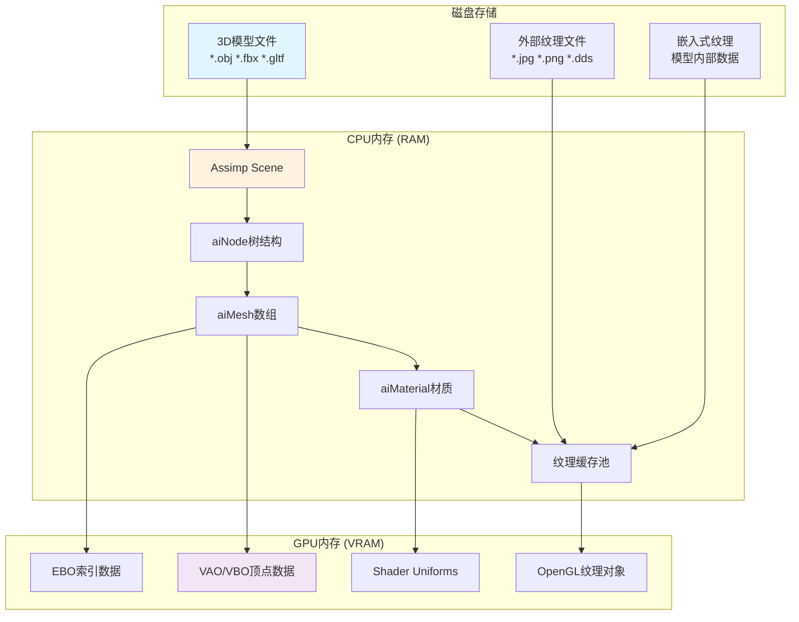

## 🔄 详细加载流程

### 1. 模型文件解析阶段

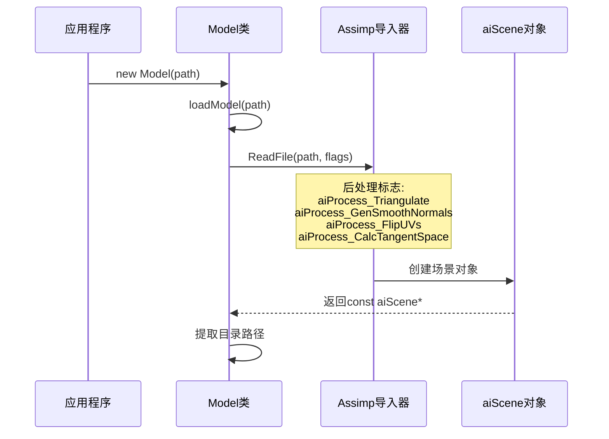

### 2. 递归节点处理

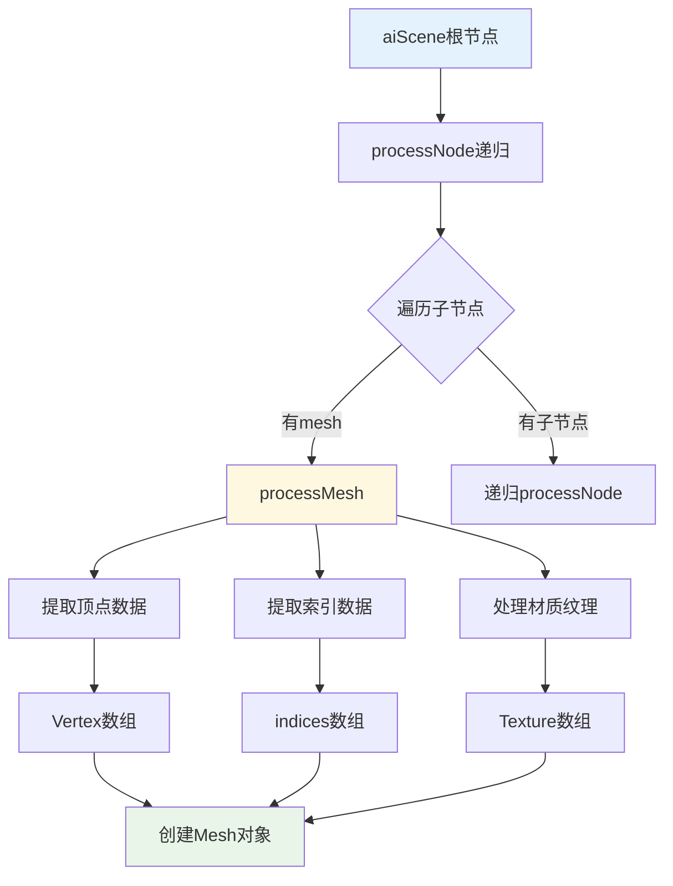

## 🎨 Assimp材质与纹理系统

### 材质类型详解

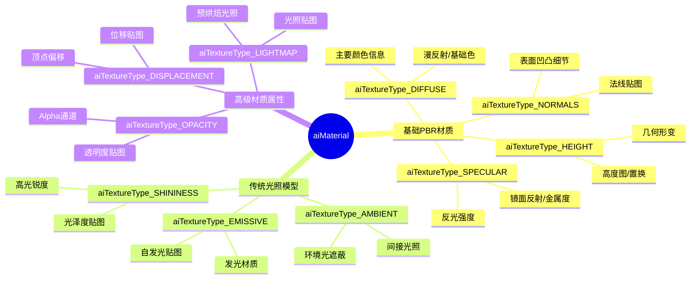

### Wind Engine材质映射策略

| Assimp类型 | Wind Engine用途 | Shader变量名 | 说明 |
|-----------|----------------|-------------|-----|
| `aiTextureType_DIFFUSE` | 基础漫反射 | `texture_diffuse1/2/3` | 草地不同层次纹理 |
| `aiTextureType_SPECULAR` | 镜面反射 | `texture_specular1` | 高光控制 |
| `aiTextureType_HEIGHT` | 法线贴图 | `texture_normal1` | 表面细节(误用HEIGHT) |
| `aiTextureType_AMBIENT` | 环境遮蔽 | `texture_ambient1` | 阴影增强 |

## 🔍 纹理加载详细流程

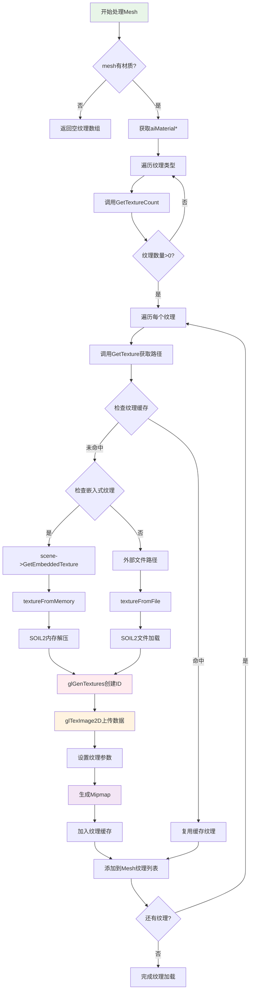

### 嵌入式纹理 vs 外部纹理

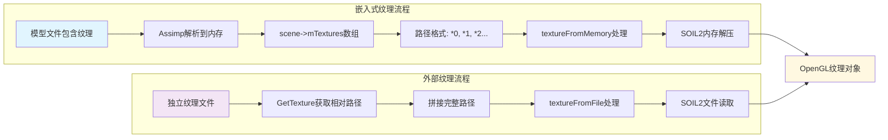

## 🚀 CPU到GPU数据传输

### 顶点数据上传流程

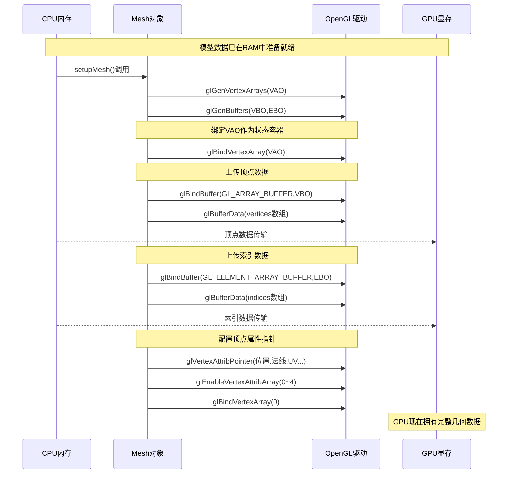

### 纹理数据上传详解

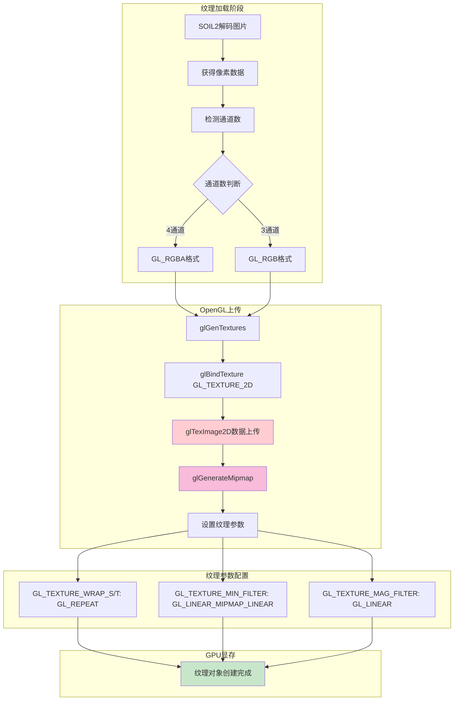

## 📊 内存使用模式分析

### 纹理缓存策略

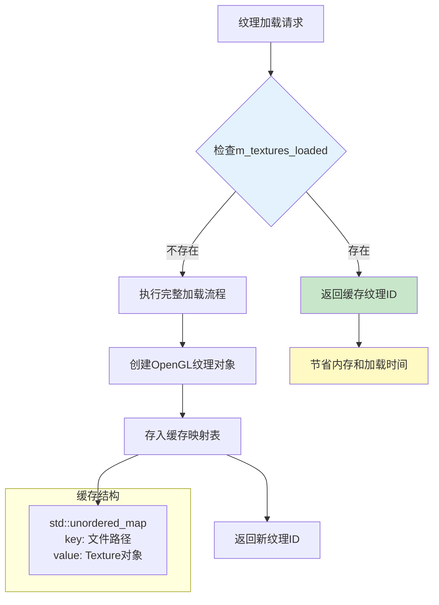

### 实例化渲染的内存布局

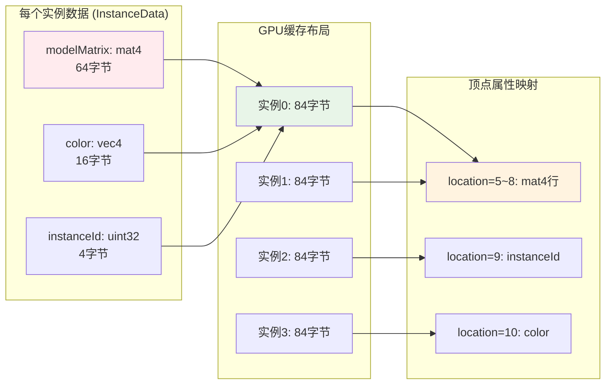

## ⚡ 性能优化要点

### 多线程加载策略

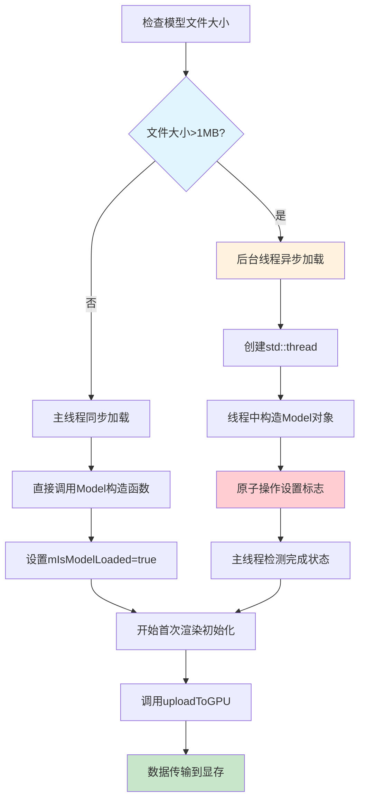

### 渲染时纹理绑定优化

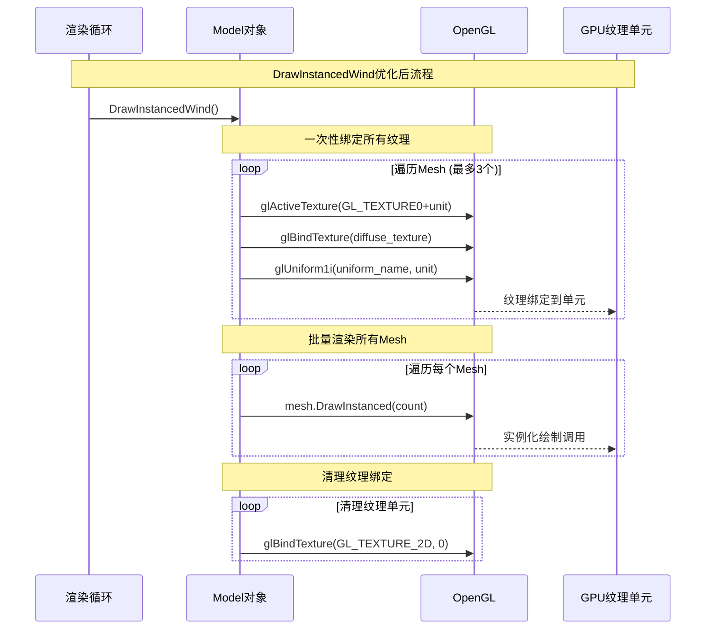

## 📈 数据流量统计

### 典型草地模型数据量

| 数据类型 | 单个实例 | 4个实例 | 说明 |
|---------|---------|---------|-----|
| 顶点数据 | ~50KB | 200KB | 位置+法线+UV+切线 |
| 索引数据 | ~15KB | 60KB | 三角形索引 |
| 实例数据 | 84B | 336B | 变换矩阵+颜色+ID |
| 纹理数据 | 2-8MB | 2-8MB | 共享纹理(DXT压缩) |
| **总计** | ~2.1MB | ~2.3MB | 显存占用量 |

### 加载时间分析

```mermaid
gantt
    title 模型加载时间分解
    dateFormat X
    axisFormat %s
    
    section 磁盘IO
    文件读取    :0, 50
    
    section CPU处理  
    Assimp解析  :50, 120
    纹理解码    :120, 200
    
    section GPU传输
    顶点上传    :200, 220
    纹理上传    :220, 280
    
    section 渲染准备
    状态设置    :280, 300
```

## 🎯 总结

Wind Engine的3D模型加载系统展现了以下特点：

### 🔧 技术优势
- **智能缓存**: 纹理去重和复用机制
- **异步加载**: 大文件后台处理保持响应性  
- **跨平台**: 统一的Assimp接口适配不同格式
- **实例化**: 高效批量渲染相同几何体
- **内存优化**: RAII和智能指针管理资源

### 📊 关键数据路径
1. **磁盘→RAM**: Assimp解析+SOIL2解码  
2. **RAM→VRAM**: OpenGL缓冲对象传输
3. **渲染**: 实例化绘制+多纹理采样

### 🚀 性能特性
- 支持嵌入式和外部纹理
- 材质属性的灵活映射
- Mipmap自动生成和过滤
- 批量状态切换优化

这个系统为Wind Engine提供了稳定高效的3D内容加载能力，特别适合需要处理复杂材质和大量实例的草地渲染场景。

---
**引擎版本**: Wind Engine v1.0  
**支持格式**: Assimp全格式 (OBJ/FBX/GLTF/GLB等)  
**目标平台**: Windows OpenGL + Android GLES