# C++ Developer Roadmap - Mermaid Mind Map

## 完整的C++开发者学习路线图

```mermaid
flowchart TD
    Start([🚀 Start C++ Learning Journey]) --> Foundation{📚 Foundation}
    
    %% Foundation Phase
    Foundation --> CS[🧮 Computer Science]
    Foundation --> DevEnv[🛠️ Development Environment]
    
    CS --> DataStruct[Data Structures]
    CS --> Algorithms[Algorithms]
    CS --> BoolAlg[Boolean Algebra]
    CS --> FSM[Finite-state Machines]
    
    DevEnv --> IDE[Choose IDE<br/>VS/CLion/Qt Creator/XCode]
    DevEnv --> Compiler[Learn Compilers<br/>GCC/Clang/MSVC/MinGW]
    DevEnv --> Debugger[Master Debugger<br/>GDB/WinDbg]
    DevEnv --> Linters[Code Quality Tools<br/>Static/Dynamic Analyzers]
    
    %% Step 1: C++ Basics
    CS --> Step1[📖 Step 1: C++ Basics]
    DevEnv --> Step1
    
    Step1 --> BasicOp[Basic Operations<br/>Arithmetic/Logical/Bitwise]
    Step1 --> DataTypes[Data Types<br/>Static/Dynamic Typing/RTTI]
    Step1 --> Functions[Functions & Lambda]
    Step1 --> Memory1[Memory Management<br/>Pointers & References]
    Step1 --> CodeStruct[Code Structure<br/>Headers/cpp files/Namespaces]
    
    Memory1 --> SmartPtr[Smart Pointers<br/>unique_ptr/shared_ptr/weak_ptr]
    Memory1 --> RawPtr[Raw Pointers<br/>new/delete/Memory Leakage]
    
    BasicOp --> Step1Complete{Step 1 Complete}
    DataTypes --> Step1Complete
    Functions --> Step1Complete
    SmartPtr --> Step1Complete
    CodeStruct --> Step1Complete
    
    %% Step 2: Object Oriented Programming
    Step1Complete --> Step2[🏗️ Step 2: Object Oriented Programming]
    
    Step2 --> Classes[Structures and Classes<br/>Rule of Zero/Three/Five]
    Step2 --> Inheritance[Inheritance<br/>Multiple/Diamond Inheritance]
    Step2 --> Polymorphism[Polymorphism<br/>Static/Dynamic/Virtual Methods]
    Step2 --> Exceptions[Exception Handling<br/>Access Violation/Error Codes]
    
    Classes --> Step2Complete{Step 2 Complete}
    Inheritance --> Step2Complete
    Polymorphism --> Step2Complete
    Exceptions --> Step2Complete
    
    %% Step 3: Advanced Language Features
    Step2Complete --> Step3[⚡ Step 3: Advanced Language Features]
    
    Step3 --> TypeCasting[Type Casting<br/>static_cast/dynamic_cast/const_cast]
    Step3 --> STL[Standard Library + STL<br/>Containers/Iterators/Algorithms]
    Step3 --> Advanced[Advanced Concepts<br/>UB/ADL/Macros/Name Mangling]
    Step3 --> Threading[Multithreading]
    
    TypeCasting --> Step3Complete{Step 3 Complete}
    STL --> Step3Complete
    Advanced --> Step3Complete
    Threading --> Step3Complete
    
    %% Step 4: Templates & Design Patterns
    Step3Complete --> Step4[🎨 Step 4: Templates & Design Patterns]
    
    Step4 --> Templates[Templates<br/>Variadic/Specialization/SFINAE]
    Step4 --> Idioms[C++ Idioms<br/>RAII/CRTP/Pimpl/Copy-Swap]
    Step4 --> Standards[C++ Standards<br/>C++11/14/17/20/newest]
    Step4 --> Patterns[Design Patterns<br/>Creational/Structural/Behavioral]
    
    Templates --> Step4Complete{Step 4 Complete}
    Idioms --> Step4Complete
    Standards --> Step4Complete
    Patterns --> Step4Complete
    
    %% Step 5: Tools & Ecosystem
    Step4Complete --> Step5[🔧 Step 5: Tools & Ecosystem]
    
    Step5 --> BuildSys[Build Systems<br/>CMake/Makefile/ninja]
    Step5 --> PackMgr[Package Managers<br/>Conan/vcpkg/nuget/spack]
    Step5 --> Libraries[Libraries<br/>boost/Qt/OpenCV/gRPC]
    Step5 --> Testing[Testing Frameworks<br/>gtest/gmock/catch2]
    
    BuildSys --> Step5Complete{Step 5 Complete}
    PackMgr --> Step5Complete
    Libraries --> Step5Complete
    Testing --> Step5Complete
    
    %% Software Engineering Practices
    Step5Complete --> SoftEng[💼 Software Engineering]
    
    SoftEng --> VCS[Version Control<br/>Git/SVN/Mercurial]
    SoftEng --> Principles[Development Principles<br/>SOLID/DRY/KISS/YAGNI]
    SoftEng --> Architecture[Software Architecture<br/>MVC/MVVM/Microservices]
    SoftEng --> CICD[CI/CD & Deployment]
    SoftEng --> CodeQuality[Code Quality<br/>Code Review/Testing/Profilers]
    
    VCS --> SoftEngComplete{Software Engineering Complete}
    Principles --> SoftEngComplete
    Architecture --> SoftEngComplete
    CICD --> SoftEngComplete
    CodeQuality --> SoftEngComplete
    
    %% System Knowledge
    SoftEngComplete --> SystemKnow[🖥️ System Knowledge]
    
    SystemKnow --> OS[Operating Systems<br/>Memory Management/File System]
    SystemKnow --> Network[Network Programming<br/>TCP/UDP/HTTP/Sockets]
    SystemKnow --> Concurrency[Concurrency<br/>Threads/Mutexes/Lock-free]
    SystemKnow --> Performance[Performance<br/>Profilers/Optimization]
    SystemKnow --> Virtualization[Virtualization<br/>Docker/Kubernetes/Cloud]
    
    OS --> SystemComplete{System Knowledge Complete}
    Network --> SystemComplete
    Concurrency --> SystemComplete
    Performance --> SystemComplete
    Virtualization --> SystemComplete
    
    %% Soft Skills Development
    SystemComplete --> SoftSkills[🤝 Soft Skills]
    
    SoftSkills --> Communication[Communication<br/>English/Presentation/Negotiation]
    SoftSkills --> Learning[Learning Abilities<br/>Critical Thinking/Adaptability]
    SoftSkills --> Leadership[Leadership<br/>Mentoring/Delegation/Planning]
    SoftSkills --> ProblemSolving[Problem Solving<br/>Time Management/Decision Making]
    
    Communication --> Expert{🎯 C++ Expert}
    Learning --> Expert
    Leadership --> Expert
    ProblemSolving --> Expert
    
    %% Career Development Path
    Expert --> Career[🚀 Career Development]
    Career --> Junior[Junior Developer<br/>Step 1-2 + Basic Soft Skills]
    Career --> Middle[Middle Developer<br/>Step 1-4 + Project Experience]
    Career --> Senior[Senior Developer<br/>Full Stack + Architecture Design]
    Career --> Architect[Technical Architect<br/>System Design + Tech Leadership]
    
    %% Style Definitions
    classDef stepClass fill:#e1f5fe,stroke:#01579b,stroke-width:2px,color:#000
    classDef completeClass fill:#c8e6c9,stroke:#2e7d32,stroke-width:2px,color:#000
    classDef skillClass fill:#fff3e0,stroke:#ef6c00,stroke-width:2px,color:#000
    classDef careerClass fill:#f3e5f5,stroke:#7b1fa2,stroke-width:2px,color:#000
    classDef foundationClass fill:#fce4ec,stroke:#ad1457,stroke-width:2px,color:#000
    
    class Step1,Step2,Step3,Step4,Step5 stepClass
    class Step1Complete,Step2Complete,Step3Complete,Step4Complete,Step5Complete,SoftEngComplete,SystemComplete completeClass
    class SoftSkills,Communication,Learning,Leadership,ProblemSolving skillClass
    class Junior,Middle,Senior,Architect careerClass
    class CS,DevEnv foundationClass
```

## Learning Path Guide

### 🎯 Learning Steps

- **Step 1**: Basic operations, data types, functions, memory management, code structure
- **Step 2**: Object Oriented Programming - classes, inheritance, polymorphism, exceptions
- **Step 3**: Advanced language features - type casting, STL, advanced concepts, multithreading
- **Step 4**: Templates & design patterns - template programming, C++ idioms, standards, patterns
- **Step 5**: Tools & ecosystem - build systems, package managers, libraries, testing frameworks

### 💼 Skill Levels

- **Junior**: Master Step 1-2, basic understanding of other concepts
- **Middle**: Proficient in Step 1-4, able to design components and create functionality
- **Senior**: Expert in all technical stack, capable of architecting entire systems
- **Architect**: System design and technical leadership skills

### 🛠️ Development Environment

Choose appropriate IDE and toolchain, master debugging skills, understand compilation principles.

### 🤝 Soft Skills

Beyond technical abilities, communication, learning capacity, and problem-solving skills are equally important.

### 📚 Foundation Knowledge

- **Computer Science**: Data structures, algorithms, boolean algebra, finite-state machines
- **Development Environment**: IDE selection, compiler knowledge, debugging tools, code quality analyzers

---

*基于 [C++ Developer Roadmap](https://github.com/salmer/CppDeveloperRoadmap) 创建*