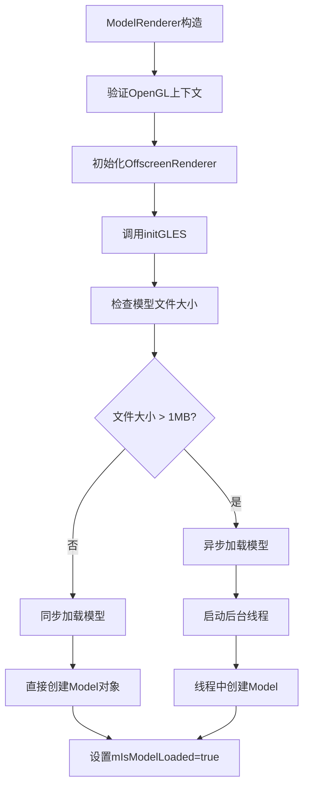

# Wind Engine 模型加载系统详解

## 📖 概述

Wind Engine是一个跨平台的3D渲染引擎，支持Windows桌面(GLFW+OpenGL)和Android(EGL+OpenGL ES)。本文档详细解析其模型加载系统的架构、调用流程和关键组件。

## 🏗️ 系统架构

### 核心组件层次结构
```
Main Application (main.cpp / jni_main.cpp)
        ↓
    ModelRenderer (渲染器核心)
        ↓
    Model (模型管理)
        ↓
    Mesh (网格数据) + Texture (纹理数据)
        ↓
    OpenGL/GLES 渲染
```

### 平台差异化处理
```cpp
// 平台检测宏
#ifdef __ANDROID__
    // Android EGL + OpenGL ES
    #include <EGL/egl.h>
    #include <GLES3/gl3.h>
#else
    // Desktop GLFW + OpenGL Core
    #include <glad/glad.h>
    #include <GLFW/glfw3.h>
#endif
```

## 🔧 关键数据结构

### 1. 顶点结构 (Vertex)
```cpp
struct Vertex {
    glm::vec3 Position;   // 位置坐标
    glm::vec3 Normal;     // 法线向量
    glm::vec2 TexCoords;  // 纹理坐标
    glm::vec3 Tangent;    // 切线向量(法线贴图用)
    glm::vec3 Bitangent;  // 副切线向量
};
```

### 2. 纹理结构 (Texture)
```cpp
struct Texture {
    GLuint id = 0;           // OpenGL纹理ID
    std::string type;        // 纹理类型:"texture_diffuse", "texture_specular"等
    std::string path;        // 原始文件路径
};
```

### 3. 实例化数据 (InstanceData)
```cpp
struct InstanceData {
    glm::mat4 modelMatrix;   // 模型变换矩阵
    glm::vec4 color;         // 实例颜色
    uint32_t instanceId;     // 实例ID
};
```

### 4. UBO全局数据 (Globals)
```cpp
struct Globals {
    glm::mat4 proj;          // 投影矩阵
    glm::mat4 view;          // 视图矩阵
    glm::mat4 model;         // 模型矩阵
    
    float time;              // 动画时间
    float waveAmp;           // 波浪振幅
    float waveSpeed;         // 波浪速度
    int pickedInstanceID;    // 选中的实例ID
    
    vec4 color;              // 全局颜色
    vec3 boundsMin;          // 包围盒最小值
    vec3 boundsMax;          // 包围盒最大值
    
    // 实例偏移数组
    InstanceOffset instanceOffsets[INSTANCES_COUNT];
};
```

## 🚀 模型加载流程

### 1. 应用程序启动
```cpp
// main.cpp (Desktop) 或 jni_main.cpp (Android)
int main() {
    // 1. 初始化窗口系统 (GLFW/ANativeWindow)
    // 2. 初始化OpenGL上下文
    // 3. 创建ModelRenderer
    ModelRenderer* renderer = new ModelRenderer(window, modelDir, width, height);
}
```

### 2. ModelRenderer 初始化流程


### 3. Model 加载详细流程
```cpp
Model::Model(const std::string& path) {
    // 1. 初始化AABB包围盒
    m_boundsMin = std::numeric_limits<float>::max();
    m_boundsMax = std::numeric_limits<float>::lowest();
    
    // 2. 调用loadModel
    loadModel(path);
}
```

#### loadModel 函数流程:
```cpp
void Model::loadModel(const std::string& path) {
    // 1. 配置Assimp导入器
    importer.SetPropertyInteger(AI_CONFIG_FAVOUR_SPEED, 1);
    
    // 2. 读取文件并进行后处理
    scene = importer.ReadFile(path,
        aiProcess_Triangulate |        // 三角化
        aiProcess_GenSmoothNormals |   // 生成平滑法线
        aiProcess_FlipUVs |            // 翻转UV坐标
        aiProcess_CalcTangentSpace);   // 计算切线空间
    
    // 3. 错误检查
    // 4. 提取目录路径
    m_directory = std::filesystem::path(path).parent_path().string();
}
```

### 4. 多线程加载策略
```cpp
void ModelRenderer::initGLES(const std::string& modelDir) {
    std::uintmax_t fileSize = std::filesystem::file_size(modelPath);
    
    if (fileSize/1000 > 1000) { // 大于1MB
        // 异步加载
        mLoadingThread = std::thread([this, modelPath](){
            try {
                auto loadedModel = std::make_unique<Model>(modelPath);
                mModel = std::move(loadedModel);
                mIsModelLoaded = true;
            } catch (const std::exception& e) {
                LOGE("Thread loading failed: %s", e.what());
            }
        });
    } else {
        // 同步加载
        auto loadedModel = std::make_unique<Model>(modelPath);
        mModel = std::move(loadedModel);
        mIsModelLoaded = true;
    }
}
```

## 🔄 渲染循环与首次初始化

### 渲染循环主流程
```cpp
void ModelRenderer::draw() {
    // 1. 早期返回检查
    if (!mIsInitialized || !mOffscreenRenderer) return;
    
    // 2. 显示加载界面(如果模型未加载完成)
    if (!mIsModelLoaded) {
        drawLoadingView();
        return;
    }
    
    // 3. 一次性初始化
    performFirstTimeInitialization();
    
    // 4. 每帧更新
    updateCameraIfNeeded();
    initializeTouchPadIfNeeded();
    
    // 5. 主渲染流程
    renderScene();
}
```

### 首次初始化详解
```cpp
void ModelRenderer::performFirstTimeInitialization() {
    if (!mIsFirstDrawAfterModelLoaded) return;
    
    mIsFirstDrawAfterModelLoaded = false;
    
    // 1. 上传模型数据到GPU
    mModel->uploadToGPU();
    
    // 2. 初始化相机系统
    initializeCameraSystem();
    
    // 3. 初始化渲染组件
    initializeRenderingComponents();
    
    // 4. 初始化实例化数据
    initializeInstancedData();
    
    // 5. 初始化纹理管理器
    initializeTextureManager();
}
```

## 🗂️ 数据上传到GPU流程

### 1. Model::uploadToGPU()
```cpp
void Model::uploadToGPU() {
    processNode(scene->mRootNode, scene);
}
```

### 2. 递归处理节点
```cpp
void Model::processNode(aiNode* node, const aiScene* scene) {
    // 处理当前节点的所有mesh
    for (unsigned int i = 0; i < node->mNumMeshes; ++i) {
        aiMesh* mesh = scene->mMeshes[node->mMeshes[i]];
        m_meshes.push_back(processMesh(mesh, scene));
    }
    
    // 递归处理子节点
    for (unsigned int i = 0; i < node->mNumChildren; ++i) {
        processNode(node->mChildren[i], scene);
    }
}
```

### 3. 处理单个Mesh
```cpp
Mesh Model::processMesh(aiMesh* mesh, const aiScene* scene) {
    std::vector<Vertex> vertices;
    std::vector<unsigned int> indices;
    std::vector<Texture> textures;
    
    // 1. 处理顶点数据
    for (unsigned int i = 0; i < mesh->mNumVertices; ++i) {
        Vertex vertex;
        vertex.Position = {mesh->mVertices[i].x, mesh->mVertices[i].y, mesh->mVertices[i].z};
        
        // 更新AABB包围盒
        m_boundsMin = glm::min(m_boundsMin, vertex.Position);
        m_boundsMax = glm::max(m_boundsMax, vertex.Position);
        
        // 法线、纹理坐标、切线等...
        vertices.push_back(vertex);
    }
    
    // 2. 处理索引数据
    for (unsigned int i = 0; i < mesh->mNumFaces; ++i) {
        aiFace face = mesh->mFaces[i];
        for (unsigned int j = 0; j < face.mNumIndices; ++j) {
            indices.push_back(face.mIndices[j]);
        }
    }
    
    // 3. 处理材质和纹理
    if (mesh->mMaterialIndex >= 0) {
        aiMaterial* material = scene->mMaterials[mesh->mMaterialIndex];
        // 加载diffuse、specular、normal、ambient纹理...
    }
    
    return Mesh(vertices, indices, textures);
}
```

## 🎨 纹理加载系统

### 纹理类型分类
```cpp
// Diffuse纹理 (漫反射)
auto diffuseMaps = loadMaterialTextures(material, aiTextureType_DIFFUSE, "texture_diffuse", scene);

// Specular纹理 (镜面反射)
auto specularMaps = loadMaterialTextures(material, aiTextureType_SPECULAR, "texture_specular", scene);

// Normal纹理 (法线贴图)
auto normalMaps = loadMaterialTextures(material, aiTextureType_HEIGHT, "texture_normal", scene);

// Ambient纹理 (环境光)
auto ambientMaps = loadMaterialTextures(material, aiTextureType_AMBIENT, "texture_ambient", scene);
```

### 纹理加载流程
```cpp
std::vector<Texture> Model::loadMaterialTextures(aiMaterial* mat, aiTextureType type, 
                                                 const std::string& typeName, const aiScene* scene) {
    std::vector<Texture> textures;
    
    for (unsigned int i = 0; i < mat->GetTextureCount(type); ++i) {
        aiString str;
        mat->GetTexture(type, i, &str);
        std::string path = str.C_Str();
        
        // 检查纹理缓存
        if (m_textures_loaded.count(path)) {
            textures.push_back(m_textures_loaded[path]);
            continue;
        }
        
        Texture texture;
        const aiTexture* embeddedTexture = scene->GetEmbeddedTexture(str.C_Str());
        
        if (embeddedTexture != nullptr) {
            // 嵌入式纹理
            texture.id = textureFromMemory(embeddedTexture);
        } else {
            // 外部纹理文件
            texture.id = textureFromFile(m_directory + "/" + path);
        }
        
        texture.type = typeName;
        texture.path = path;
        textures.push_back(texture);
        m_textures_loaded[path] = texture; // 缓存
    }
    
    return textures;
}
```

## 🎯 实例化渲染系统

### 实例化数据设置
```cpp
void Model::setupInstances(const std::vector<InstanceData>& instanceData) {
    m_instanceData = instanceData;
    m_hasInstanceData = true;
    
    // 为每个mesh设置实例化数据
    for (auto& mesh : m_meshes) {
        mesh.setupInstance(m_instanceData);
    }
}
```

### Mesh实例化设置
```cpp
void Mesh::setupInstance(const std::vector<InstanceData>& instanceData) {
    hasInstanceData = true;
    
    glBindVertexArray(VAO);
    glGenBuffers(1, &instanceVBO);
    glBindBuffer(GL_ARRAY_BUFFER, instanceVBO);
    glBufferData(GL_ARRAY_BUFFER, instanceData.size() * sizeof(InstanceData), 
                 &instanceData[0], GL_STATIC_DRAW);
    
    // 设置实例化属性 (location 5-10)
    // ModelMatrix (mat4) -> 需要4个vec4属性
    for (int i = 0; i < 4; i++) {
        glEnableVertexAttribArray(5 + i);
        glVertexAttribPointer(5 + i, 4, GL_FLOAT, GL_FALSE, sizeof(InstanceData), 
                             (void*)(offsetof(InstanceData, modelMatrix) + i * sizeof(glm::vec4)));
        glVertexAttribDivisor(5 + i, 1); // 每个实例更新一次
    }
    
    // InstanceID (uint)
    glEnableVertexAttribArray(9);
    glVertexAttribIPointer(9, 1, GL_UNSIGNED_INT, sizeof(InstanceData), 
                          (void*)offsetof(InstanceData, instanceId));
    glVertexAttribDivisor(9, 1);
    
    // Color (vec4)
    glEnableVertexAttribArray(10);
    glVertexAttribPointer(10, 4, GL_FLOAT, GL_FALSE, sizeof(InstanceData), 
                         (void*)offsetof(InstanceData, color));
    glVertexAttribDivisor(10, 1);
}
```

### 实例化绘制
```cpp
void Model::DrawInstancedWind(GLuint program, GLuint instanceCount) const {
    // 1. 绑定所有diffuse纹理到正确的纹理单元
    int textureUnit = 0;
    for (size_t meshIndex = 0; meshIndex < m_meshes.size() && meshIndex < 3; ++meshIndex) {
        const Mesh& mesh = m_meshes[meshIndex];
        
        for (unsigned int i = 0; i < mesh.textures.size(); ++i) {
            if (mesh.textures[i].type == "texture_diffuse") {
                glActiveTexture(GL_TEXTURE0 + textureUnit);
                glBindTexture(GL_TEXTURE_2D, mesh.textures[i].id);
                
                std::string uniformName = "material.texture_diffuse" + std::to_string(textureUnit + 1);
                glUniform1i(glGetUniformLocation(program, uniformName.c_str()), textureUnit);
                
                textureUnit++;
                break;
            }
        }
    }
    
    // 2. 绘制所有mesh (实例化)
    for (const Mesh& mesh : m_meshes) {
        mesh.DrawInstanced(instanceCount);
    }
    
    // 3. 清理纹理绑定
    // ...
}
```

## 📡 Shader系统集成

### Vertex Shader 输入布局
```glsl
// 顶点属性
layout(location=0) in vec3 aPos;         // 位置
layout(location=1) in vec3 aNormal;      // 法线
layout(location=2) in vec2 aTexCoords;   // 纹理坐标

// 实例化属性
layout(location=5) in mat4 aInstanceMatrix;  // 实例变换矩阵 (5,6,7,8)
layout(location=9) in uint aInstanceId;      // 实例ID
layout(location=10) in vec4 aColor;          // 实例颜色
```

### Fragment Shader 纹理采样
```glsl
struct Material {
    sampler2D texture_diffuse1;  // 纹理单元0
    sampler2D texture_diffuse2;  // 纹理单元1
    sampler2D texture_diffuse3;  // 纹理单元2
};

void main() {
    float opacity;
    if (layerIndex < 0.05) {
        texColor = texture(material.texture_diffuse1, moving_coords);
        opacity = 0.0;
    } else if (layerIndex - 1.0 < 0.05) {
        texColor = texture(material.texture_diffuse2, moving_coords);
        opacity = 0.0;
    } else {
        texColor = texture(material.texture_diffuse3, moving_coords);
        opacity = 0.8;
    }
}
```

## 🎮 相机和交互系统

### 相机初始化
```cpp
void ModelRenderer::initializeCameraSystem() {
    mCamera = std::make_unique<Camera>();
    m_cameraInteractor = std::make_unique<CameraInteractor>(mCamera.get());
    
    // 计算模型中心和深度
    m_modelCenter = (mModel->boundsMin() + mModel->boundsMax()) * 0.5f;
    m_modelDepth = glm::length(mModel->boundsMax() - mModel->boundsMin());
    
    // 设置相机参数
    mCamera->setTarget(glm::vec3(0.0, 0.0, 0.0));
    mCamera->setDistance(m_modelDepth * 0.7f);
}
```

### 触摸交互流程
```cpp
// Android JNI 回调
extern "C" JNIEXPORT void JNICALL
Java_com_example_learnkotlin_MainActivity_onTouchDown(JNIEnv *env, jobject thiz, jfloat x, jfloat y) {
    if (g_renderer) {
        g_renderer->onTouchDown(x, y);
    }
}

// Desktop GLFW 回调
void mouse_button_callback(GLFWwindow* window, int button, int action, int mods) {
    if (button == GLFW_MOUSE_BUTTON_LEFT && action == GLFW_PRESS) {
        double xpos, ypos;
        glfwGetCursorPos(window, &xpos, &ypos);
        g_renderer->onTouchDown(static_cast<float>(xpos), static_cast<float>(ypos));
    }
}
```

## 🔧 调试和优化特性

### 包围盒渲染
```cpp
void ModelRenderer::initializeRenderingComponents() {
    mBoundingBoxRenderer = std::make_unique<BoundingBoxRenderer>();
    if (!mBoundingBoxRenderer->initialize()) {
        LOGE("Failed to initialize BoundingBoxRenderer");
    }
}

// 渲染包围盒
if (mShowBoundingBox && mBoundingBoxRenderer) {
    mBoundingBoxRenderer->render(mModel->boundsMin(), mModel->boundsMax(), 
                                viewMatrix, projMatrix);
}
```

### 性能监控
```cpp
// 模型加载时间统计
auto startTime = std::chrono::high_resolution_clock::now();
// ... 模型加载 ...
auto duration = std::chrono::duration_cast<std::chrono::milliseconds>(
    std::chrono::high_resolution_clock::now() - startTime).count();
LOGI("Model loading time: %lld ms", duration);
```

### 内存管理
```cpp
// 纹理缓存避免重复加载
std::unordered_map<std::string, Texture> m_textures_loaded;

// 智能指针自动管理资源
std::unique_ptr<Model> mModel;
std::unique_ptr<ModelProgram> mProgram;
std::unique_ptr<OffscreenRenderer> mOffscreenRenderer;
```

## 🏁 总结

Wind Engine的模型加载系统具有以下特点：

### ✅ 优势
1. **跨平台兼容**: 统一的API，支持Windows和Android
2. **异步加载**: 大文件自动使用后台线程，保持UI响应
3. **实例化渲染**: 高效渲染大量相同物体
4. **纹理缓存**: 避免重复加载相同纹理
5. **AABB包围盒**: 自动计算用于碰撞检测和相机设置
6. **内存安全**: 大量使用智能指针和RAII

### 🎯 关键设计模式
1. **策略模式**: 不同平台的OpenGL初始化策略
2. **工厂模式**: Model和Mesh的创建
3. **观察者模式**: 渲染状态的异步更新
4. **组合模式**: Model包含多个Mesh
5. **缓存模式**: 纹理的懒加载和缓存

这个系统为3D渲染应用提供了坚实的基础，特别适合需要加载复杂3D模型并进行实时渲染的应用场景。

---
**版本**: Wind Engine v1.0  
**支持格式**: OBJ, FBX, GLTF, GLB等Assimp支持的所有格式  
**平台**: Windows (OpenGL Core) + Android (OpenGL ES 3.0+)